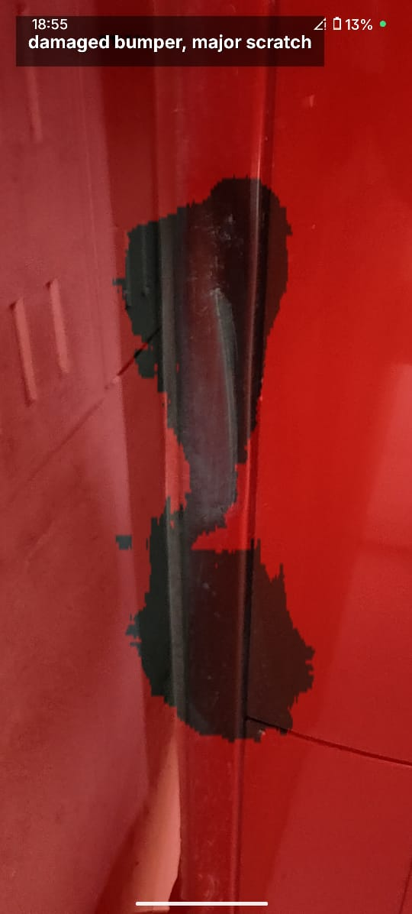
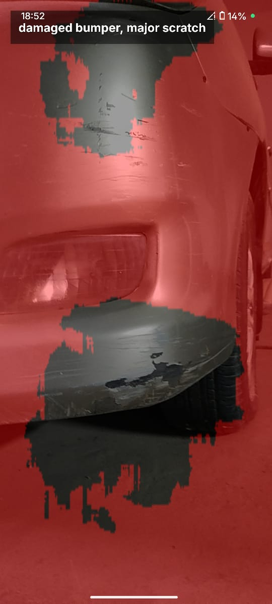

# Car Damage Detection Android App 🚗🔧

## 📖 Description

This is an Android application for **car damage detection** using a **custom U-Net model** converted to **TFLite**.

- Built with **Kotlin** in Android Studio
- Uses a **small U-Net model** trained on a limited dataset → only detects:
  - **Damaged bumper**
  - **Major scratch**
- The model is **overconfident** and sometimes predicts damage even when none exists
- The **UI is basic/shabby** since this was an experimental build
- For full **model construction and training code**, please refer to my other repository:  
  👉 [U-Net Model Repo](https://github.com/sujith283/Car-Damage-Detection-using-UNet)

⚠️ **Note**: This was started in **January**, and I finally got time to upload it now. The app is not production-ready but shows the workflow.

---

## 🛠 Features

- Custom **U-Net (TFLite)** inference on Android
- Single-screen app UI
- Segmentation mask overlay showing detected damages

---

## 📂 Folder Structure

```
CarDamageDetection/
├── app/                    # Main Android app module
│   ├── src/               # Kotlin source code & resources
│   ├── build.gradle.kts
│   └── ...
├── gradle/                # Gradle wrapper
├── build.gradle.kts
├── gradle.properties
├── settings.gradle.kts
├── gradlew
├── gradlew.bat
└── .gitignore
```

---

## 📸 Screenshots

<p align="center">
  
  
  
</p>


---

## 🚀 Getting Started

### Prerequisites

- Android Studio (latest recommended)
- Android Emulator or physical device (Android 8.0+)

### Clone the Repository

```bash
git clone https://github.com/your-username/CarDamageDetection.git
cd CarDamageDetection
```

### Open in Android Studio

1. Open Android Studio
2. Select **Open an Existing Project**
3. Choose this project folder
4. Let Gradle sync

### ▶️ Running the App on Emulator

1. Open **Tools > Device Manager** in Android Studio
2. Create a new Virtual Device (Pixel 4/5 recommended)
3. Choose a system image (API 30+)
4. Start the emulator
5. Click **Run ▶️** in Android Studio → the app will launch

### 📥 Download APK

Prebuilt APK available under [Releases](https://github.com/sujith283/Car_Damage_Detection_App/tree/main/app/release) go ahead and downoad app-release.apk .

1. Download the latest `.apk` file
2. Install it on your Android device

---

## ⚡ Limitations

- Very small dataset → poor generalization
- Only detects bumper and major scratch
- Model sometimes shows damage even when none exists
- UI is minimal and needs improvements

---

## 🙌 Credits

- Custom U-Net architecture for segmentation
- TensorFlow Lite for Android integration
- Kotlin + Android Studio

---


## 🤝 Contributing

Contributions are welcome! Please feel free to submit a Pull Request.

## 📧 Contact

If you have any questions or suggestions, feel free to reach out:
- GitHub: [@sujith283](https://github.com/sujith283)
- Email: your.email@example.com
